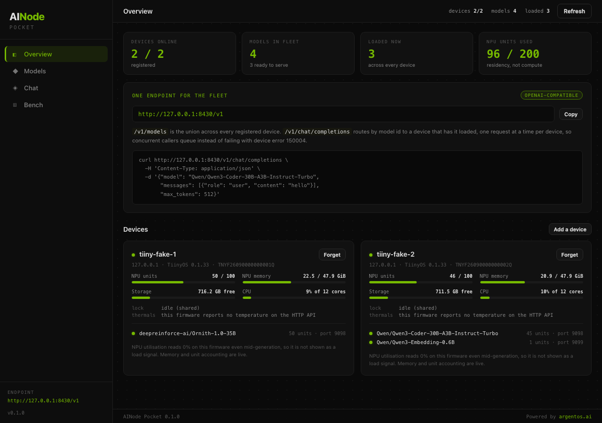
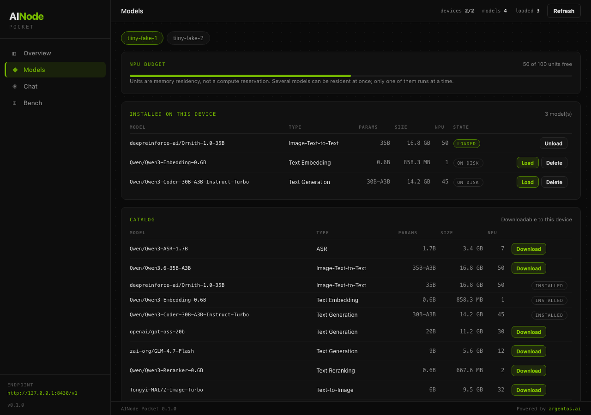
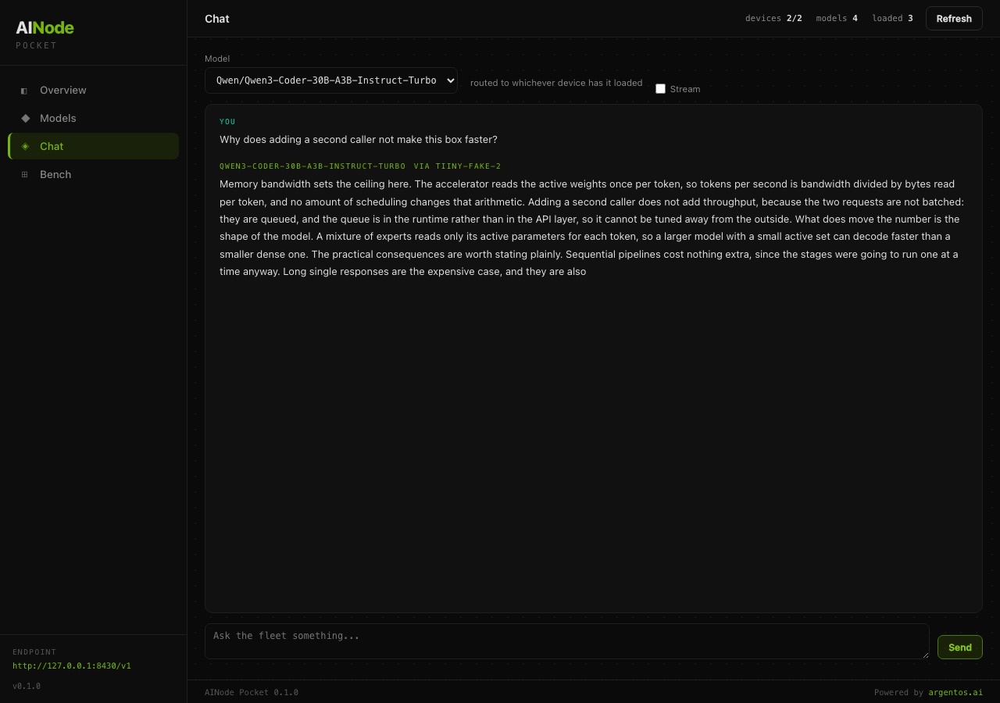
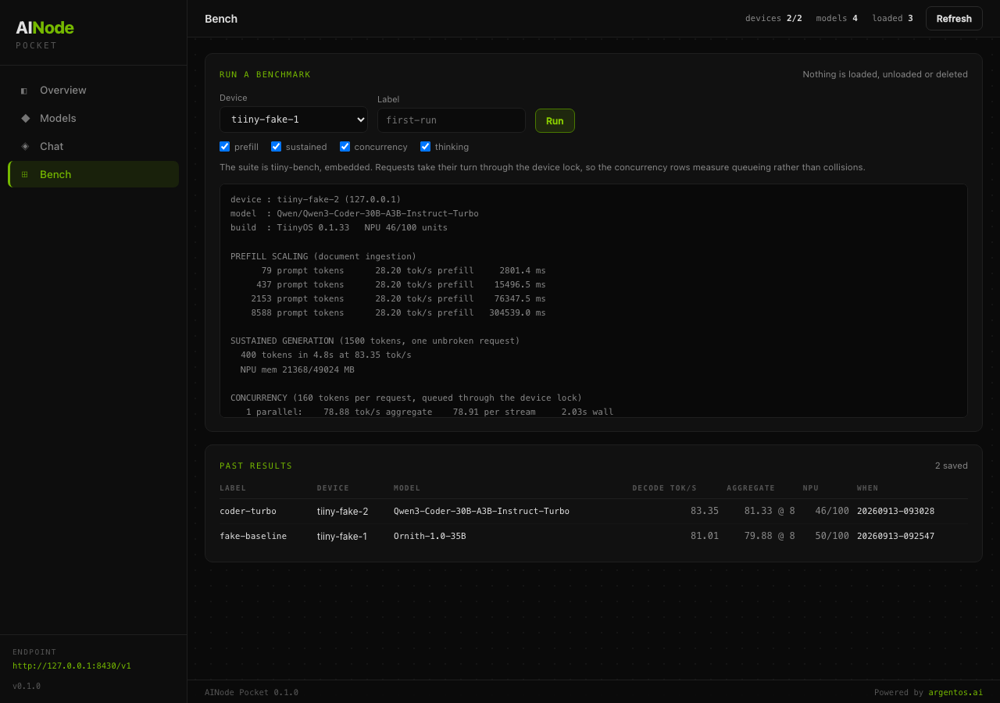

# AINode Pocket

Registers every Tiiny AI Pocket Lab you own, shows what each one is doing, manages the models on them, and puts a single OpenAI-compatible endpoint in front of the whole fleet. For anyone with one or more Tiiny boxes who wants to point ordinary OpenAI clients at them and stop hand-managing which model is loaded where.

```
python3 ainode-pocket --serve
```

One command, one page on port 8430, one base URL for your clients. Python 3.9 or newer, standard library only, no pip install, no accounts, no cloud.



---

## What it does

**Registers devices.** Paste an address, or let it read `/device.json` from the
unauthenticated discovery service on port 39218. A subnet scan is available and
is opt-in, never automatic.

**Shows what each device is doing.** NPU units used of the 100 available, NPU
memory, storage, CPU, every loaded model with its instance port and unit cost,
and whether the device is busy or has callers queued.

**Manages models per device.** The installed list and the downloadable catalog,
with load, unload, delete, and download with live progress over the device's own
server-sent-events endpoint.

**Serves one endpoint.** `/v1/models` is the union across your devices.
`/v1/chat/completions` routes by model id, streaming or not.

**Chats and benchmarks.** A chat page that talks to that same endpoint, and the
tiiny-bench suite embedded as a page and a CLI subcommand.

## What it deliberately does not do

- **No training and no fine-tuning.** That is AINode's job, on hardware built for
  it. This is a fleet manager.
- **No quantization or model conversion.** The NPU runs vendor-compiled models
  and its import path accepts exactly one architecture. Nothing here pretends
  otherwise.
- **No container control on the device.** Compose services are listed nowhere in
  this app and never started, stopped, or created. That API is root-equivalent
  and reachable from the LAN; it is not something a fleet dashboard should be
  clicking.
- **No accounts, no TLS, no vendor cloud.** It runs on your machine, beside your
  devices, and talks to them over the LAN exactly as any other client would.
- **No pip dependencies and no GUI framework.** One HTTP server, three files of
  front end, the standard library.

---

## The endpoint contract

Point any OpenAI client at `http://127.0.0.1:8430/v1`. The API key is ignored:
the app already holds your device keys and it does not authenticate its own
callers, which is why it is worth thinking about before binding it to an
address the whole office can reach.

### `GET /v1/models`

The union of every model installed on every registered device. Each row carries
a namespaced block a strict OpenAI client will ignore:

```json
{
  "id": "deepreinforce-ai/Ornith-1.0-35B",
  "object": "model",
  "owned_by": "2 devices",
  "ainode_pocket": {
    "ready": true,
    "type": "Image-Text-to-Text",
    "params": "35B",
    "devices": ["TNY...01Q", "TNY...03Q"],
    "loaded_on": ["TNY...01Q"]
  }
}
```

`ready` means at least one device has it loaded and a request will be served now.
`GET /v1/models?loaded=1` returns only those.

### `POST /v1/chat/completions`

Standard request body. Routing works like this:

1. Find the devices that have this model **loaded**. Not installed: loaded.
   Models do not auto-load on this hardware and a 35B takes tens of seconds to
   come up, so Pocket will not start one behind your back to serve a chat.
2. Among those, pick the shortest queue, then the fewest loaded models, so work
   spreads across a fleet instead of piling onto the first box.
3. Take that device's lock, make the call, release it.

The response carries `ainode_pocket.device` so you can tell which box answered.

### When it cannot serve you

A 503 that names the problem, rather than a generic failure:

```
"Qwen/Qwen3-Embedding-0.6B" is installed on TNYM26072400300011Q but is not
loaded on any of them. Models do not auto-load on this hardware: load it on the
Models page first.
```

```
no device in this fleet has a model called 'gpt-4o'. Installed across the
fleet: Qwen/Qwen3-Coder-30B-A3B-Instruct-Turbo, deepreinforce-ai/Ornith-1.0-35B
```

A 504 means the device gateway closed the request. On real firmware that happens
at about 220 seconds, measured at 222.3 s after 580 tokens with the client
timeout still at 780 s. The message says so and tells you to stream, because
streaming is the only way partial output survives that ceiling.

---

## The lock, and why it is the point

A Tiiny runs one inference at a time. It does not batch. A second request
arriving mid-inference comes back as HTTP 200 with this in the body:

```json
{"code": 150004, "message": "The operation failed to complete."}
```

Which reads like a bad request rather than "somebody else is using it". Inside
one program you can queue your own calls. It stops being easy the moment a
second program touches the same device, because your queue and its queue have
never heard of each other.

**The design here is [OneLane](https://tiinyapp.farm/apps/onelane/)'s**, which
solved this properly first: an advisory `fcntl.flock` file in a directory both
applications can see, so the kernel releases it if a holder is killed, there is
no lease to expire and no stale state to reap. Pocket vendors that logic rather
than importing it, because it ships with the standard library alone, and it
keeps OneLane's file naming and holder record on purpose. A Pocket process and a
OneLane process pointed at the same device take out the same lock file and
genuinely take turns.

Two limits, both OneLane's as well, and worth knowing:

- The lock is **advisory**. A program that ignores it still collides.
- `flock` coordinates processes on **one host**. Two machines pointed at one
  Tiiny share no lock file and get no mutual exclusion at all.

The Overview page says whether the shared lock is actually held, because a lock
that quietly stops being shared is worse than one that admits it.

---

## Install

### From the farm

```
farm install ainode-pocket
farm start ainode-pocket
```

The farm writes `~/.tiinyapps/device.json` (mode 0600) when you run
`farm device`, and passes `TIINY_BASE` and `TIINY_KEY` to the app. Pocket reads
its first device from there.

### From git

```
git clone https://github.com/getainode/ainode-pocket
cd ainode-pocket
python3 ainode-pocket --serve
```

There is nothing to build and nothing to install.

### Where the key comes from

Never from this repository. In order:

1. `TIINY_KEY` in the environment, which is what the farm sets.
2. `~/.tiinyapps/device.json`, the file the farm CLI writes.
3. The TiinyOS desktop app's local storage on macOS, the same lookup tiiny-bench
   uses.

A fleet has several keys and only one of them is in `~/.tiinyapps/device.json`,
so a per-device key can be stored in `~/.ainode-pocket/devices.json`, written
0600 in your home directory. Nothing is ever written into the repository, and
there is a test that fails if a key appears in it.

---

## Screenshots

Every screenshot below was taken against `--fake 2`. See the hardware note at the
bottom.

### Models

Installed models and the catalog for one device, with the NPU budget above them.
Units are memory residency, not a compute reservation: several models can be
resident at once, only one of them runs at a time.



### Chat

The chat page is an ordinary client of `/v1/chat/completions` on this app. The
header of a reply says which device answered it. A reasoning model's chain of
thought is shown separately from the answer, because it is spending the same
`max_tokens` budget the answer needs.



### Bench

tiiny-bench, embedded. Prefill scaling against prompt length, sustained
generation, concurrency, and what a reasoning model charges in wall time.
Nothing is loaded, unloaded or deleted: it benchmarks whatever is already
running, which is what makes it safe on a box doing real work.

Requests take their turn through the device lock, so the concurrency rows
measure queueing rather than collisions. The shape to look for is aggregate
throughput staying flat while wall time doubles with each level, which is the
signature of a strict serial queue rather than a batching scheduler.



---

## Command line

```
python3 ainode-pocket --serve                      web app and endpoint on 0.0.0.0:8430
python3 ainode-pocket --serve --fake 2             two fake devices, no hardware
python3 ainode-pocket --device 192.168.100.70      register a device and exit
python3 ainode-pocket --discover 192.168.100.70    read /device.json from one address
python3 ainode-pocket --scan 192.168.100           probe a /24 for devices
python3 ainode-pocket --bench --device <id> --label first-run
python3 ainode-pocket --results                    list saved benchmark results
python3 ainode-pocket --selfcheck                  offline check, no hardware
```

`--serve` binds `0.0.0.0` so another machine on the LAN can reach the page. Use
`--host 127.0.0.1` if you would rather it did not.

## Tests

```
python3 -m unittest discover -s tests
```

107 tests, no hardware and no network beyond loopback. They run against a fake
device that reproduces the recorded response shapes, and each assertion in
`tests/test_fake.py` names the artefact its shape came from. The fake also
reproduces both failures that matter, so the code has actually met them: the
in-band 150004 collision, and the gateway's per-request ceiling.

The test this project exists for is in `tests/test_gateway.py`: eight callers
arrive at one device at the same time, all eight get answers, and the device
records zero collisions. Its control case fires the same load straight at the
device with no lock and asserts that it does collide, so the first test is
measuring the lock rather than a device that never had the problem.

---

## Hardware validation checklist

**Every device call in this build was made against the fake device in
`pocket/fake.py`. None of it has touched real hardware.** The Tiiny at
192.168.100.70 was unreachable throughout, so the fake was built from the
recorded artefacts instead: `spec-8800.json` (the gateway's own OpenAPI
document) for the schema shapes, `RUNBOOK.md` for the live-verified bodies the
spec declares only as free-form objects, and `CAPABILITIES.md` for the measured
behaviour and the NPU unit costs. Where a shape could not be sourced from a
recording it is marked unverified in the code rather than guessed.

Work through this against a real device before trusting any of it:

| # | Check | Expected |
|---|---|---|
| 1 | `python3 ainode-pocket --discover <address>` | device name and serial from `/device.json`, no key needed |
| 2 | `python3 ainode-pocket --scan <subnet>` | finds the device, touches nothing else |
| 3 | `python3 ainode-pocket --device <address>` | registers, and prints NPU units and loaded models |
| 4 | Overview page | units, NPU memory, storage and CPU match `/api/v1/sys/status` and the TiinyOS app |
| 5 | Overview, thermals row | either real readings, or the honest "this firmware reports no temperature" |
| 6 | Models page | installed list and unit costs match the TiinyOS Models screen |
| 7 | Load a small model (the 0.6B embedding model, 1 unit) | appears in the running list within seconds |
| 8 | Load something that does not fit the remaining budget | refused with the device's own message, not a silent failure |
| 9 | Unload it | disappears; the response carries `removed_container_ids` |
| 10 | Download from the catalog | progress advances and the SSE stream ends at 100 |
| 11 | Delete a loaded model | refused with 409, as the spec declares |
| 12 | `curl /v1/models` | the union matches what each device reports |
| 13 | Chat page, one question | answers, and names the device that served it |
| 14 | Ask for a model that is installed but not loaded | 503 naming the device that holds it |
| 15 | Eight concurrent callers (`--bench`, concurrency test) | all served, zero 150004, aggregate flat at about 24 tok/s |
| 16 | Run OneLane against the same device while Pocket is busy | it waits rather than colliding; check `/tmp/turnstile/` for one lock file, not two |
| 17 | Ask for a very long answer, non-streaming | 504 at about 220 s with the ceiling explained |
| 18 | The same request with `stream: true` | tokens keep arriving past that point |
| 19 | Two devices registered | `/v1/models` unions them and routing reaches both |
| 20 | Pull the network on one device | that card goes offline with a reason; the other keeps serving |

Rows 15 to 18 are the ones most likely to differ from the fake, because they are
the ones that depend on real NPU timing.

---

## Layout

```
ainode-pocket          the CLI and the entry point the farm runs
pocket/device.py       one device: encoding, auth, error shapes, lifecycle, SSE
pocket/fleet.py        registry, per-device lock, telemetry, routing
pocket/gateway.py      /v1/models and /v1/chat/completions
pocket/server.py       the HTTP server, the JSON API, static assets
pocket/bench.py        tiiny-bench, embedded
pocket/fake.py         a fake device built from the recorded artefacts
web/                   the page: one html, one css, one js
tests/                 107 tests, no hardware
manifests/             the tiinyapp.farm manifest
```

Apache 2.0. Powered by [argentos.ai](https://argentos.ai).
